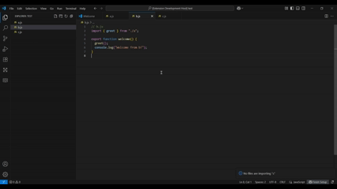

# React File Trecker

A VS Code extension that helps you **track imports** of any file in your workspace.  
Works with **JavaScript, TypeScript, React (JSX/TSX)** projects.

---

## 🚀 Features
- 🔍 Find all files that import the currently open file.
- 📂 Results displayed in a dedicated **Sidebar Panel**.
- ⚡ Works with `.js`, `.jsx`, `.ts`, and `.tsx`.
- 🖱️ Click on a result to directly open the file.
- 🛠️ Case-insensitive & supports imports with or without extensions.

---

## 📸 Demo

---

## 📖 Usage
1. Open a file in your project (`.js`, `.jsx`, `.ts`, or `.tsx`).
2. Open the **Command Palette** (`Ctrl+Shift+P` on win || or `Cmd+Shift+P` on Mac).
3. Run the command:
